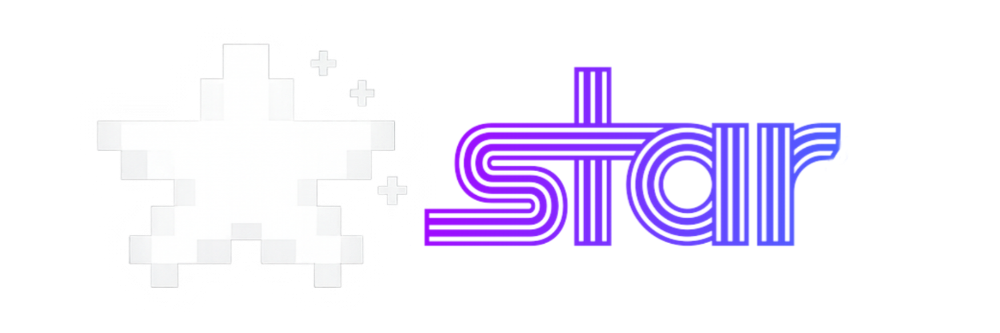

  

  

<h1 align="center"> star Marcescence -
Windows applications and games on Android.</h1>

**star** is an application that lets you play PC games on Android with the best performance possible. It lets you access your Steam, Amazon, GOG and Epic Games library on the go.

**Informations:**
- **Package:** `com.star.marcescence` (standard), `com.tencent.ig` (pubg), `com.ludashi.benchmark` (ludashi)

- **Version:** `codename-marcescene` (build identifier `7.1.4x-cmod`, versionCode `20`)

- **Android SDK:** `compileSdk 34`, `targetSdk 28`, `minSdk 26` (Android 8.0+)

- **Upstream lineage:** Winlator → cmod → Bionic Nightly → star Marcescence → WinHub Marcescence

---

# Links

- [Discord server](https://discord.gg/Q74CNHJnq2)
    
- [Telegram](https://t.me/staremul)

---

## Building

This project is built via **GitHub Actions only**. Local builds are not supported.

Artifacts are published as workflow artifacts; tagged stable builds are also published as GitHub Releases.

---

## Credits

This fork stands on a long chain of prior work. Credit, in lineage order:

| Contributor | Contribution |
|---|---|
| **brunodev85** | Original [Winlator](https://github.com/brunodev85/winlator) — Wine + Box64 + Turnip on Android. Foundation of every fork below. Also serves the `input_controls` profiles consumed by this fork: <https://raw.githubusercontent.com/brunodev85/winlator/main/input_controls/> |
| **coffincolors** | [`cmod` Winlator fork](https://github.com/coffincolors/winlator) — package `com.winlator.cmod` and the customization layer this codebase is built on. |
| **Pipetto-crypto** | [Winlator Bionic fork](https://github.com/Pipetto-crypto/winlator) (the "Bionic" half of *Star Bionic*) and the upstream [Box64 fix branch](https://github.com/Pipetto-crypto/box64). Co-credited on cmod. |
| **jacojayy** | Maintainer of the [Star](https://github.com/jacojayy/star) line. Timeline Semaphore patches in the bundled Turnip driver for newer DXVK compatibility. Official site developer and mantainer. |
| **vivsi** | Controller support contributions. |
| **The412Banner** | Full Jetpack Compose UI migration, in-game overlay rewrite, controller-support restore (SDL2 SoName fix + four event files), Box64 edit-dialog fix, theme system, and CI/release infrastructure. Also maintains the [Nightlies WCP Hub](https://github.com/The412Banner/Nightlies) and [Banners-Turnip](https://github.com/The412Banner/Banners-Turnip). |

### Sibling forks (not in this fork's direct lineage, but worth knowing)

- **StevenMXZ** — [Winlator-Ludashi](https://github.com/StevenMXZ/Winlator-Ludashi): Bionic-based fork with `dev-vanilla`, `ludashi` (renamed package for Xiaomi performance-mode detection), and `redmagic` (Genshin Impact package name for RedMagic frame-gen) build variants.

### Upstream stack

The Wine/translation stack this app bundles or downloads:

- **Wine** — [WineHQ](https://www.winehq.org/)
- **Box64 / Box86** — [ptitSeb](https://github.com/ptitSeb)
- **FEXCore** — [FEX-Emu](https://github.com/FEX-Emu)
- **DXVK** — [doitsujin / Philip Rebohle](https://github.com/doitsujin)
- **DXVK-GPLAsync patch** — [Ph42oN](https://gitlab.com/Ph42oN)
- **DXVK-Sarek** — [pythonlover02](https://github.com/pythonlover02)
- **VKD3D-Proton** — [Hans-Kristian Arntzen](https://github.com/HansKristian-Work)
- **Turnip / Mesa** — [Freedreno team @ Mesa](https://gitlab.freedesktop.org/mesa/mesa)
- **Proton layers (bionic)** — [GameNative](https://github.com/utkarshdalal/GameNative)

If you have contributed and are not listed, open a PR — this list is intended to be complete.

---

## Disclaimer

Winlator and its forks are unofficial community projects. They are not affiliated with or endorsed by Microsoft, Wine, the Mesa project, Qualcomm, or any game publisher. Compatibility varies by device GPU, Android version, and individual game.

---

## License

Inherits the license of the upstream Winlator project (GPL-3.0). See `LICENSE` for the full text.
